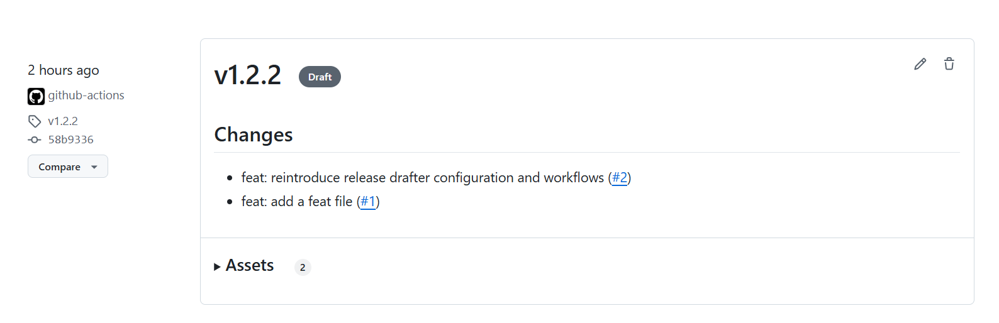

## `CHANGELOG.md` file (kept in the repo)

This is **version-controlled** along with your code. It lives in the root directory of the project.

#### Example:

```markdown
# Changelog

## [1.2.0] - 2025-06-15
### Added
- Dark mode for UI
- Search functionality with fuzzy matching

### Fixed
- Footer overlapping issue on mobile

### Security
- Input sanitization for search queries

## [1.1.1] - 2025-05-10
### Fixed
- Crash on clicking "Submit" when form was empty
```

> 🔹 Pro tip: You can auto-generate changelogs from commits using tools like:

* [`standard-version`](https://github.com/conventional-changelog/standard-version)
* [`conventional-changelog`](https://github.com/conventional-changelog/conventional-changelog)
* GitHub Actions or CI plugins (e.g., `release-drafter`)


####  Summary

| Location          | How to Add Release Info                                     |
| ----------------- | ----------------------------------------------------------- |
| GitHub Releases   | Web UI or API when creating a release from a tag            |
| `CHANGELOG.md`    | Markdown file in your repo, updated manually or via scripts |
| Annotated Git Tag | `git tag -a v1.2.0 -m "Summary"` → message is short only    |
| CI/CD tools       | Auto-generate changelogs or attach messages during tagging  |


## How to apply changelog automatically

####  1. `standard-version`

A tool that uses **conventional commits** to automatically bump version numbers and update a `CHANGELOG.md`.

#### 🔧 Setup:

1. **Install the package** (Node.js project):

   ```bash
   npm install --save-dev standard-version
   ```

2. **Update your `package.json`:**

   ```json
   "scripts": {
     "release": "standard-version"
   }
   ```

3. **Make commits using conventional format**:

   ```
   feat: add login functionality
   fix: correct password validation error
   ```

4. **Run release script**:

   ```bash
   npm run release
   ```

#### 🔥 What it does:

* Bumps your version in `package.json`
* Updates `CHANGELOG.md` with commits
* Creates a new Git tag (e.g., `v1.2.0`)

> Optional: `git push --follow-tags && npm publish` for full automation.


###  2. `conventional-changelog`

More flexible; used when you want to customize changelogs deeply or use it outside of npm projects.

#### 🔧 Install:

```bash
npm install -g conventional-changelog-cli
```

#### 📄 Generate changelog:

```bash
conventional-changelog -p angular -i CHANGELOG.md -s
```

> note: `npx conventional-changelog -p angular -i CHANGELOG.md -s` doesnt run cause of higher node version. might need to downgrade or else throws error.

> `-p angular` means it uses the [Angular commit convention](https://github.com/angular/angular/blob/main/CONTRIBUTING.md#commit), which is the most common.

#### Variants:

* `-i` = input file (CHANGELOG.md)
* `-s` = overwrite file in place

> 💡 You can create `.versionrc` to customize the behavior.


####  3. `release-drafter` (GitHub Action)

Automatically creates **draft GitHub releases** based on merged PR titles and labels.

#### 🧰 Setup:

1. Create `.github/release-drafter.yml` in your repo:

   ```yaml
   name-template: 'v$NEXT_PATCH_VERSION'
   tag-template: 'v$NEXT_PATCH_VERSION'
   categories:
     - title: '🚀 Features'
       labels:
         - 'feature'
     - title: '🐛 Bug Fixes'
       labels:
         - 'bug'
   change-template: '- $TITLE (#$NUMBER)'
   template: |
     ## Changes

     $CHANGES
   ```

2. Add the GitHub Action in `.github/workflows/release-drafter.yml`:

   ```yaml
   name: Release Drafter

   on:
     push:
       branches:
         - main
     pull_request:
       types: [closed]

   jobs:
     update_release_draft:
       runs-on: ubuntu-latest
       steps:
         - uses: release-drafter/release-drafter@v6
           with:
             config-name: release-drafter.yml
           env:
             GITHUB_TOKEN: ${{ secrets.GITHUB_TOKEN }}
   ```

3. **Label your pull requests** properly (`feature`, `bug`, etc.)

> 🎉 GitHub will auto-generate a release draft with grouped PRs, and you can publish it manually.(not during commits to the main branch)
- result release will be found among the other releases: 


### 🧠 Summary Comparison:

| Tool                     | Best For                          | Commit Style Needed  | Output                |
| ------------------------ | --------------------------------- | -------------------- | --------------------- |
| `standard-version`       | Node projects, full release flow  | Conventional Commits | `CHANGELOG.md`, tags  |
| `conventional-changelog` | Flexible CLI changelog generation | Conventional Commits | `CHANGELOG.md`        |
| `release-drafter`        | GitHub-based teams, PR-based logs | PR titles + labels   | GitHub release drafts |


