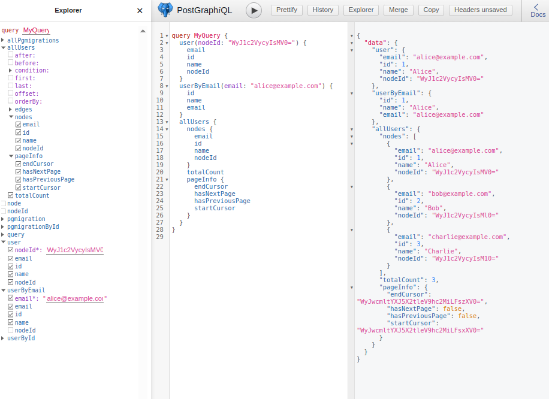

- opens in PostGraphiQL
- have to create the db manually, then run migrations
- to create migrations run `npx node-pg-migrate create file-name -j swl -m src/db/migrations`. npm scripts are not helping for this
- for running up and down migrations npm scripts are fine
